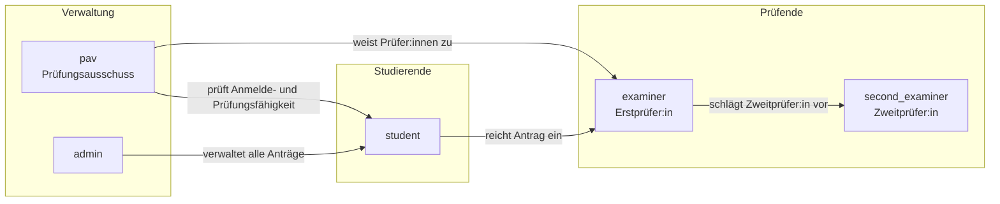
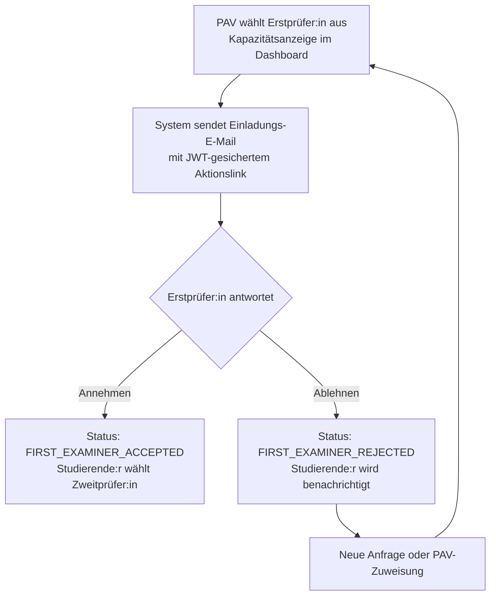
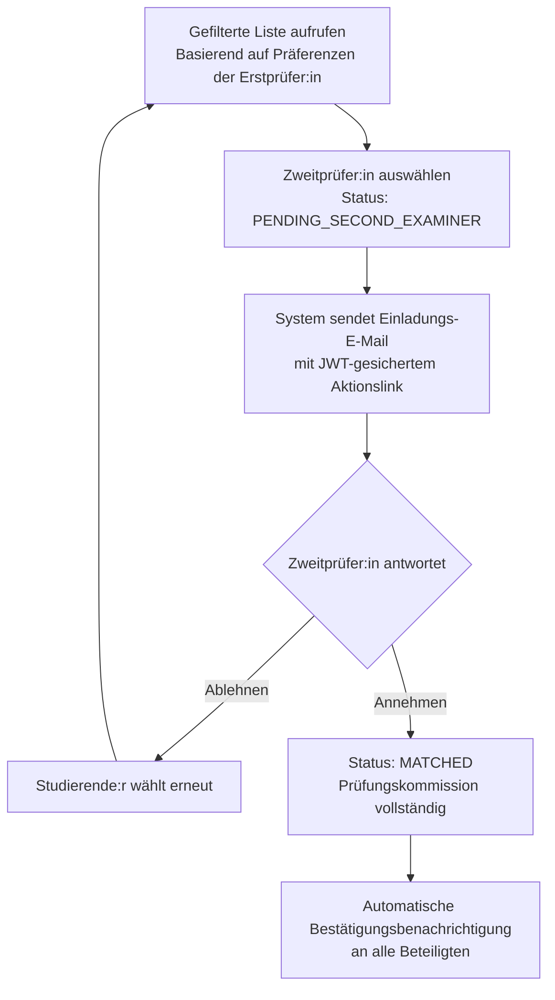
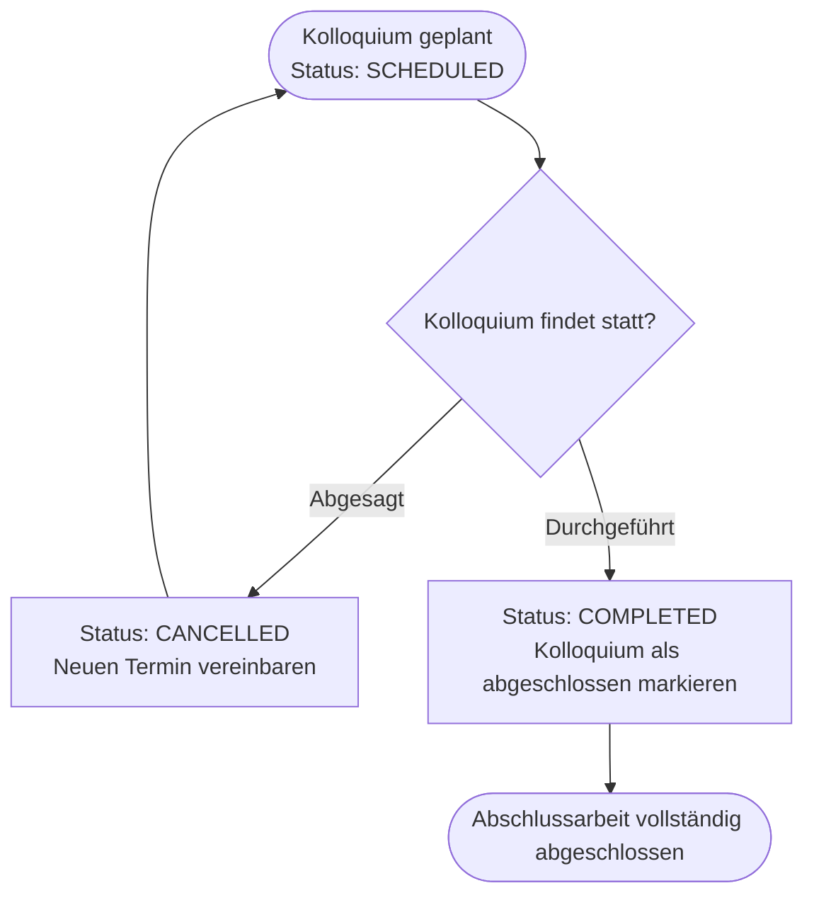
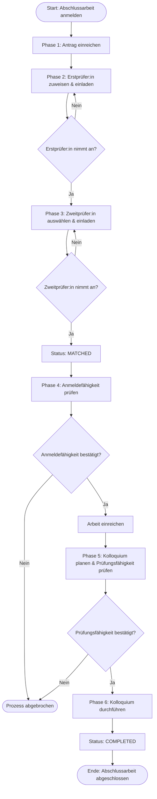

# Prozesse der Abschlussarbeit – HTW Berlin
## Begleitdokument zur Präsentation

**HTW Berlin – University of Applied Sciences · Thesis Match Maker**
Stand: Juni 2026

---

## Folie 1 – Titelfolie

Die Präsentation dokumentiert alle administrativen Prozessschritte zur Abwicklung einer Abschlussarbeit an der **HTW Berlin**. Der Gesamtprozess gliedert sich in **sechs aufeinander aufbauende Phasen** – von der Antragstellung bis zum abgeschlossenen Kolloquium.

**Zielgruppe:** Studierende, Prüfer:innen (Erst- und Zweitprüfer:in), Prüfungsausschussvorsitz (PAV)

---

## Folie 2 – Agenda

| Nr. | Themenblock |
|---|---|
| 01 | Rollen & Verantwortlichkeiten |
| 02 | Phase 1 – Antragstellung |
| 03 | Phase 2 – Zuweisung der Erstprüfer:in |
| 04 | Phase 3 – Auswahl der Zweitprüfer:in |
| 05 | Phase 4 – Anmeldefähigkeit & Abgabe |
| 06 | Phase 5 – Kolloquiumsplanung & Prüfungsfähigkeit |
| 07 | Phase 6 – Kolloquium & Abschluss |
| 08 | Statusübergänge & Fazit |

---

## Folie 3 – Rollen & Verantwortlichkeiten

Das System kennt vier Hauptrollen, die jeweils unterschiedliche Aufgaben und Zugriffsrechte besitzen.

| Rolle | Systemkennung | Kernaufgaben |
|---|---|---|
| **Studierende** | `student` | Antrag einreichen, Prüfer:innen anfragen, Arbeit abgeben, Kolloquium absolvieren |
| **Erstprüfer:in** | `examiner` | Betreuungsanfragen annehmen/ablehnen, Kapazitäten pflegen, Zweitprüfer:in-Präferenzen hinterlegen, Kolloquium durchführen |
| **Zweitprüfer:in** | `second_examiner` | Einladung per JWT-Link annehmen/ablehnen, Kolloquium koordinieren und durchführen |
| **PAV** | `pav` | Prüfer:innen zuweisen, Anmelde- und Prüfungsfähigkeit prüfen, alle Anträge des Studiengangs einsehen |

Weitere Rollen für übergeordnete Verwaltungsaufgaben: **Dekanat** (`dean`), **Admin** (`admin`), **Superadmin** (`superadmin`).

---

## Folie 4 – Phase 1: Antragstellung

Studierende initiieren den Prozess durch die digitale Einreichung eines Antrags. Alle relevanten Informationen zur geplanten Abschlussarbeit werden im System erfasst.

### Pflichtangaben beim Antrag

| Feld | Beschreibung |
|---|---|
| **Titel der Arbeit** | Vorläufiger oder endgültiger Titel der Abschlussarbeit |
| **Fachbereich** | Wird automatisch aus dem Studierendenprofil übernommen |
| **Abschlussart** | Bachelor- oder Masterarbeit |
| **Sprache der Arbeit** | Deutsch oder Englisch |
| **Gewünschte Erstprüfer:in** | Optional – der PAV kann auch direkt zuweisen |
| **Exposé / Kurzbeschreibung** | Kurze Beschreibung des Vorhabens |

> **Status nach Einreichung:** `PENDING_FIRST_EXAMINER`

**Hinweis:** Solange keine Prüfer:in zugesagt hat, kann der Antrag jederzeit zurückgezogen werden (Status: `WITHDRAWN`).

---

## Folie 5 – Phase 2: Zuweisung der Erstprüfer:in

Der PAV weist dem Antrag eine Erstprüfer:in zu. Die Prüfer:in erhält eine automatische Einladungs-E-Mail mit einem JWT-gesicherten Aktionslink.

### Prozessablauf

> **Besonderheit:** Prüfer:innen können Anfragen direkt per E-Mail annehmen oder ablehnen – **ohne Login-Pflicht**. Der JWT-Link ist zeitlich begrenzt und einfach verwendbar.

---

## Folie 6 – Phase 3: Auswahl der Zweitprüfer:in

Nach der Zusage der Erstprüfer:in wählen Studierende eine Zweitprüfer:in aus einer **gefilterten Liste**. Die Filterliste basiert auf den Präferenzen der Erstprüfer:in.

### Einschränkungen bei der Auswahl

- Die Zweitprüfer:in darf nicht identisch mit der Erstprüfer:in sein
- Nur Prüfer:innen mit freien Kapazitäten werden angezeigt
- Nur freigegebene Rollen sind wählbar

### Prozessablauf

---

## Folie 7 – Phase 4: Anmeldefähigkeit & Abgabe

Nachdem beide Prüfer:innen zugesagt haben (`MATCHED`), prüft der PAV die formalen Voraussetzungen der/des Studierenden für die Anmeldung zur Abschlussarbeit.

### Prüfung der Anmeldefähigkeit

1. Antrag hat Status `MATCHED` – PAV wird automatisch benachrichtigt
2. PAV prüft erbrachte Leistungsnachweise und formale Voraussetzungen im Dashboard
3. PAV bestätigt oder lehnt die Anmeldefähigkeit ab

| Ergebnis | Konsequenz |
|---|---|
| **Bestätigt** | Studierende:r kann die Arbeit einreichen |
| **Abgelehnt** | Prozess wird abgebrochen; Beratung empfohlen |

### Abgabe & Kolloquiumsplanung

Nach Bestätigung der Anmeldefähigkeit:

4. Studierende:r reicht die Arbeit im System ein – Zeitpunkt wird protokolliert
5. Kolloquiumsplanung beginnt: Datum, Uhrzeit und Raum werden koordiniert

> **Automatische Benachrichtigungen:** Anmeldefähigkeit bestätigt/abgelehnt → E-Mail an Studierende:n; Arbeit eingereicht → Bestätigung an alle Beteiligten.

---

## Folie 8 – Phase 5: Kolloquiumsplanung & Prüfungsfähigkeit

Das Kolloquium wird im System angelegt und der PAV prüft parallel die Prüfungsfähigkeit der/des Studierenden.

### Kolloquium anlegen

1. Termin festlegen: Datum, Uhrzeit und Raum werden eingetragen
2. Status wechselt auf `SCHEDULED` – alle Beteiligten werden benachrichtigt
3. Mehrere Termine möglich, falls ein Termin abgesagt werden muss (`CANCELLED`)

### Prüfungsfähigkeit (PAV)

Der PAV bestätigt oder blockiert die Prüfungsfähigkeit vor dem Kolloquium.

| Ergebnis | Konsequenz |
|---|---|
| **Bestätigt** | Kolloquium findet planmäßig statt |
| **Blockiert** | Kolloquium wird verschoben; neuer Termin erforderlich |

> **Hinweis:** Prüfungsfähigkeit und Kolloquiumsplanung laufen **parallel**. Die Bestätigung der Prüfungsfähigkeit ist Voraussetzung für die Durchführung des Kolloquiums.

---

## Folie 9 – Phase 6: Kolloquium & Abschluss

Das Kolloquium wird durchgeführt und im System als abgeschlossen markiert. Damit ist der gesamte Prozess der Abschlussarbeit digital abgewickelt und vollständig dokumentiert.

### Ablauf des Kolloquiums

1. Kolloquium findet statt – Termin, Raum und Prüfer:innen sind im System hinterlegt
2. Erst- oder Zweitprüfer:in markiert das Kolloquium im System als `COMPLETED`
3. Studierende:r und PAV erhalten eine Abschlussbenachrichtigung
4. Audit-Log wird finalisiert – alle Prozessschritte dauerhaft dokumentiert

> **Endstatus:** `COMPLETED` – Abschlussarbeit vollständig abgewickelt

---

## Folie 10 – Statusübergänge im Überblick

### Antragsstatus

| Status | Phase | Bedeutung | Nächster Schritt |
|---|---|---|---|
| `PENDING_FIRST_EXAMINER` | 1 | Antrag eingereicht, Erstprüfer:in ausstehend | PAV weist Erstprüfer:in zu |
| `FIRST_EXAMINER_ACCEPTED` | 2 | Erstprüfer:in hat zugesagt | Studierende:r wählt Zweitprüfer:in |
| `FIRST_EXAMINER_REJECTED` | 2 | Erstprüfer:in hat abgelehnt | Neue Anfrage oder PAV-Zuweisung |
| `PENDING_SECOND_EXAMINER` | 3 | Zweitprüfer:in eingeladen, Antwort ausstehend | Zweitprüfer:in antwortet per JWT-Link |
| `MATCHED` | 3 | Beide Prüfer:innen haben zugesagt | PAV prüft Anmeldefähigkeit |
| `WITHDRAWN` | — | Antrag zurückgezogen (vor Zusage) | Prozess beendet |

### Kolloquiumsstatus

| Status | Phase | Bedeutung |
|---|---|---|
| `SCHEDULED` | 5 | Kolloquium geplant, Termin festgelegt |
| `CANCELLED` | 5 | Kolloquium abgesagt, neuer Termin nötig |
| `COMPLETED` | 6 | Kolloquium abgeschlossen, Prozess beendet |

### Audit-Log

Jeder Statuswechsel wird mit **Zeitstempel**, **Nutzer:in** und **Aktion** protokolliert. Das Audit-Log gewährleistet vollständige Nachvollziehbarkeit aller Prozessschritte und ist für PAV und Admin im Dashboard einsehbar.

---

## Folie 11 – Zusammenfassung

Das Thesis Match Maker-System digitalisiert und automatisiert den gesamten Verwaltungsprozess der Abschlussarbeit – von der Antragstellung bis zum abgeschlossenen Kolloquium.

### Kernvorteile des Systems

**1. Automatische Benachrichtigungen**
E-Mails mit JWT-gesicherten Aktionslinks bei jedem Statuswechsel – kein manuelles Nachfassen erforderlich.

**2. Vollständige Transparenz**
Alle Beteiligten sehen den aktuellen Status in Echtzeit. Das Audit-Log protokolliert jeden Schritt lückenlos.

**3. JWT-gesicherte Aktionslinks**
Prüfer:innen können Anfragen direkt per E-Mail annehmen oder ablehnen – ohne Login-Pflicht.

**4. Rollenbasierte Zugriffssteuerung**
Studierende, Prüfer:innen, PAV, Dekanat und Admin sehen jeweils nur die für sie relevanten Informationen.

**5. Statistiken & Auswertungen**
Admin-Dashboard mit Echtzeit-Statistiken zu Anträgen, Statusverteilung und Prüfer:innenauslastung.

---

## Gesamtprozess im Überblick

---

*Dokument erstellt für die HTW Berlin – University of Applied Sciences.*
*Thesis Match Maker · Stand: Juni 2026*
