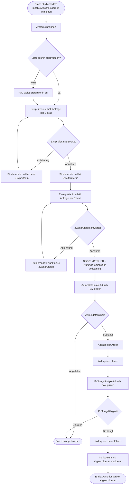
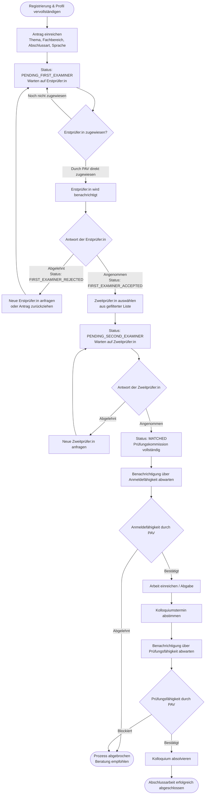
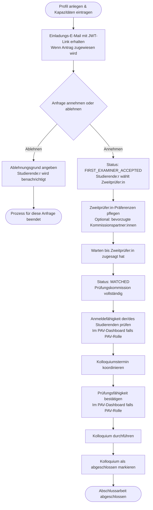
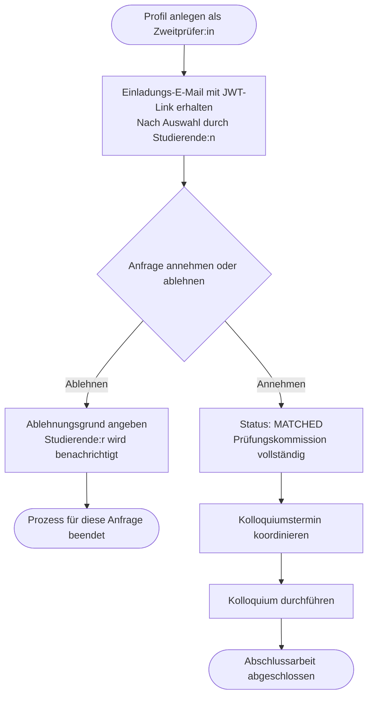
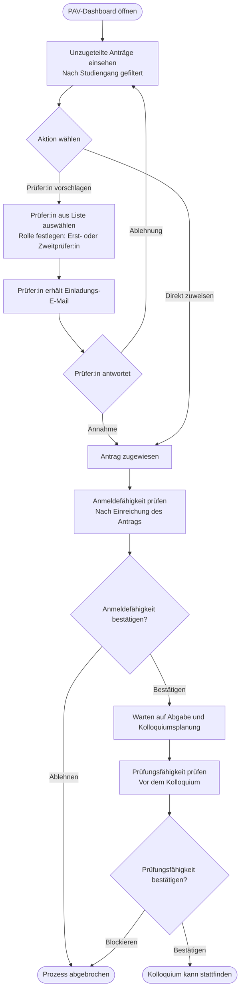
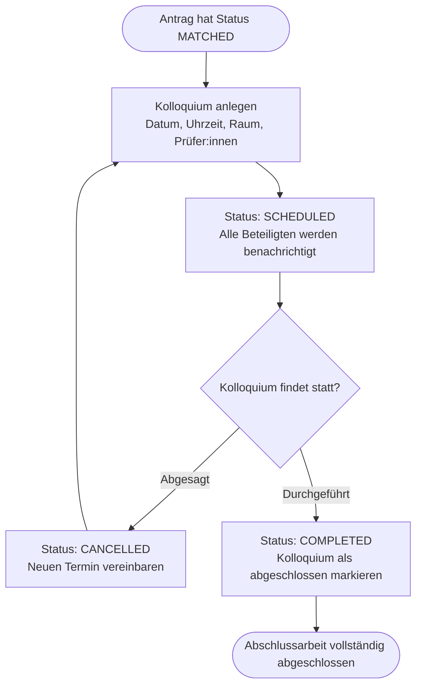
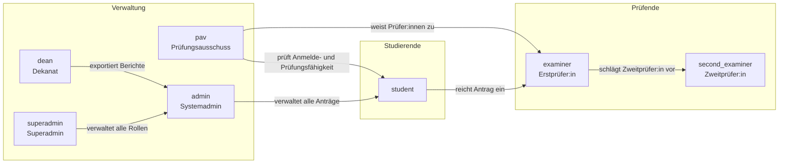
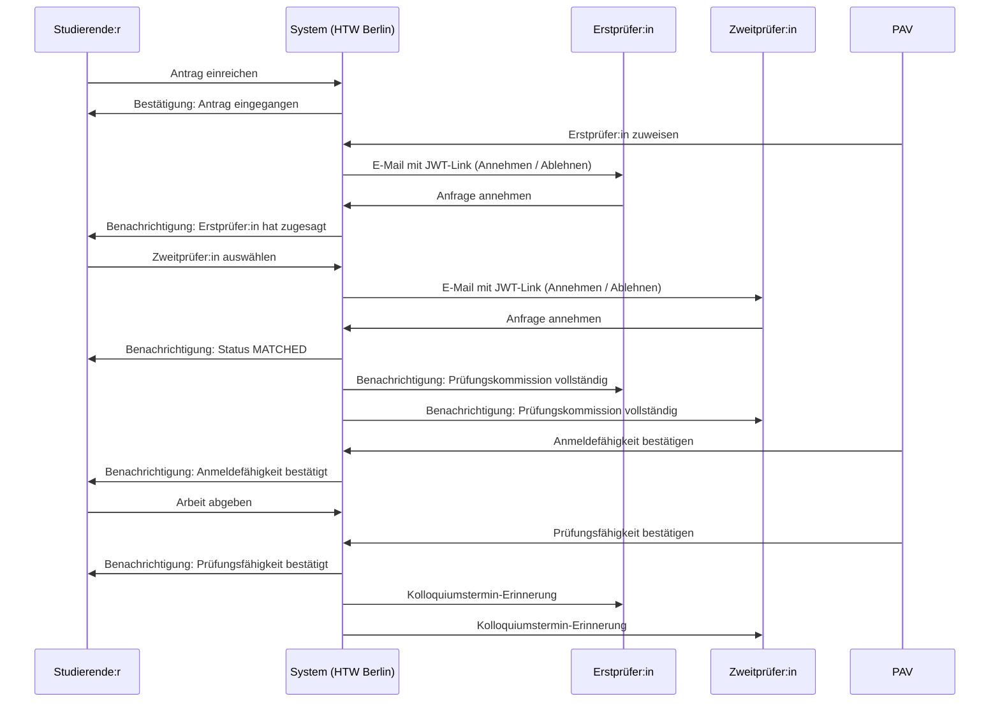
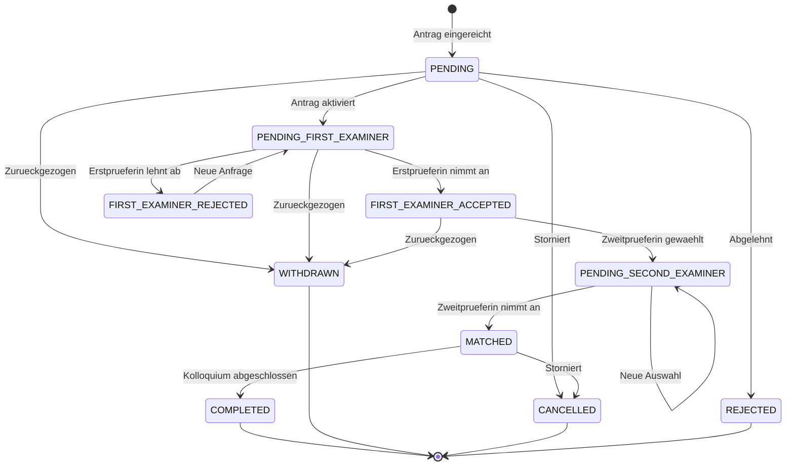

# Prozesse der Abschlussarbeit – HTW Berlin

Dieses Dokument beschreibt alle administrativen Prozessschritte zur Abwicklung einer Abschlussarbeit an der HTW Berlin, sowohl aus Sicht der **Studierenden** als auch aus Sicht der **Prüfer:innen**. Die Diagramme sind im [Mermaid](https://mermaid.js.org/)-Format erstellt.

---

## 1. Gesamtprozess im Überblick

---

## 2. Prozess aus Sicht der Studierenden

### Statusübersicht für Studierende

| Status | Bedeutung |
|---|---|
| `PENDING` | Antrag eingegangen, noch nicht bearbeitet |
| `PENDING_FIRST_EXAMINER` | Warten auf Zuweisung einer Erstprüfer:in |
| `FIRST_EXAMINER_ACCEPTED` | Erstprüfer:in hat zugesagt |
| `FIRST_EXAMINER_REJECTED` | Erstprüfer:in hat abgelehnt |
| `PENDING_SECOND_EXAMINER` | Zweitprüfer:in wurde gewählt, wartet auf Antwort |
| `MATCHED` | Beide Prüfer:innen haben zugesagt |
| `WITHDRAWN` | Antrag wurde von Studierenden zurückgezogen |
| `COMPLETED` | Abschlussarbeit vollständig abgeschlossen |
| `REJECTED` | Antrag abgelehnt (durch Verwaltung) |
| `CANCELLED` | Antrag storniert |

---

## 3. Prozess aus Sicht der Prüfer:innen

### 3a. Erstprüfer:in

### 3b. Zweitprüfer:in

### 3c. PAV (Prüfungsausschussvorsitz)

---

## 4. Kolloquiumsprozess

---

## 5. Rollen im System

---

## 6. E-Mail-Benachrichtigungen im Prozess

---

## 7. Statusübergänge (vollständige Übersicht)

---

*Dokument erstellt für die HTW Berlin – University of Applied Sciences.*
*Stand: Juni 2026*
